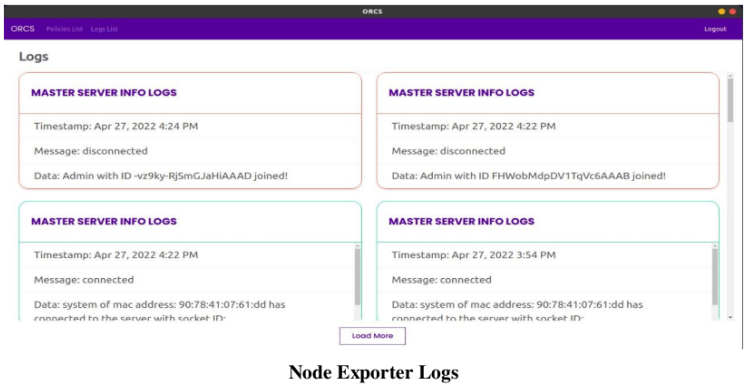

# ORCS - Open Resource Control And Surveillance Toolkit

A multi-threaded, fault-tolerant, scalable, and cross-platform dashboard to view real-time CPU and Memory usage of multiple systems and their processes. Its main focus is to control and monitor resource utilization through Identity Access Management (IAM).

## Overview

ORCS (Open Resource Control and Surveillance Toolkit) is a comprehensive system designed for monitoring and controlling computer resources across different operating systems. It focuses on real-time surveillance of system metrics and implements policies for application banning to ensure optimal resource utilization and security. Built to be scalable, ORCS offers fine-grained control over connected systems through its modular architecture.

## Features

- A Dashboard to get information about:
  - System Information
  - CPU and Memory consumption
  - Network Interfaces
  - System Processes
- Process Dashboard to check all the processes running in the system
- CPU and Memory usage visualization of each process
- Policies based Identity Access Management feature for restricted access to resources
- Stateless Application (non-persistent storage)
- Every connected system is registered to the Database
- Multi-threading using Node.js Cluster Module, so every thread in CPU is serving requests
- Uses Redis caching for Master to know which worker is assigned to which system.
- Support for Cross-Platform

## Technologies used

- Node.js (Express)
- Socket.io
- MongoDB
- Redis
- Electron / React
- ApexCharts
- Shards UI

## Modules

### ORCS Client

- **Purpose**: Handles non-admin end user functionalities.
- **Key Functions**:
  - Users log in using credentials hashed with the Scrypt algorithm.
  - Applies the "default" policy with a set of banned applications until login.
  - Allows guest login with policies applied based on user groups.
- **Technologies**: Electron, React.js
- **Relevant Files**: 
  - Home.js
  - Login.js
  - Register.js
  - SessionDashboard.js

### ORCS Admin

- **Purpose**: Admin portal for system administrators.
- **Key Functions**:
  - Provides a dashboard with telemetry data such as CPU usage, memory usage, and network interfaces.
  - Displays a list of software and scripts running on each connected system.
  - Shows system logs with timestamps, activity messages, MAC addresses, and session details.
  - Allows creating, modifying, and deleting users and policies.
  - Gives a comprehensive view and control over all connected systems.

### Node Exporter

- **Purpose**: Extracts system metrics from hardware and sends them to the master server.
- **Key Functions**:
  - Continuously collects data using the `systeminformation` package.
  - Sends real-time telemetry data to the admin dashboard.
  - Mutates and transmits user details and system data through socket connections.
- **Relevant Files**: 
  - systemInfo.mjs
  - socketMain.mjs

### ORCS API-Server

- **Purpose**: Manages user authentication and policy handling.
- **Key Functions**:
  - Authenticates users and admins using credentials provided from the client.
  - Manages user details in the MongoDB database.
  - Performs CRUD operations on user policies.
  - Establishes connections with storage systems to fetch updated policies.

### ORCS Master

- **Purpose**: Central module that coordinates data flow and system processes.
- **Key Functions**:
  - Receives telemetry data from Node Exporter and sends it to the admin dashboard.
  - Utilizes Node.js cluster module for multi-threading to handle workloads efficiently.
  - Maintains connections with MongoDB and Redis databases for data storage and session management.
- **Relevant Files**: 
  - socketMain.mjs
  - worker.mjs

## Other Important Implementations

- **Multi-threading Support**: Utilizes Node.js cluster module for creating worker processes to handle multiple instances of the socket.io server.
- **Socket.IO Usage**: Enables low-latency, bidirectional communication between client and server, with support for WebSocket connections.
- **Round Robin Algorithm**: Distributes incoming connections evenly among worker processes using a round-robin scheduling approach.

## Running the ORCS Application

To run the ORCS application, follow these step-by-step instructions. Ensure you have Node.js, MongoDB, and Redis installed on your system before proceeding.

### Step 1: Clone the Repository

1. Open your terminal.
2. Clone the ORCS repository using Git:
   ```shell
   git clone https://github.com/your-repository/ORCS.git
   ```
3. Navigate to the cloned directory:
   ```shell
   cd ORCS
   ```

### Step 2: Install Dependencies

1. Install the Node.js dependencies for each part of the application (assuming separate directories for client, server, etc.):
   - For the server:
     ```shell
     cd server
     npm install
     ```
   - For the client (if applicable):
     ```shell
     cd ../client
     npm install
     ```

### Step 3: Start MongoDB

1. Ensure MongoDB is running on your system. The method to start MongoDB depends on your installation and operating system. For most systems, it can be started with:
   ```shell
   mongod
   ```
2. Make sure MongoDB is accessible and running on its default port (27017).

### Step 4: Start Redis Server

1. Start the Redis server. This also depends on your system, but generally, it can be started with:
   ```shell
   redis-server
   ```

### Step 5: Configure Environment Variables

1. Set up necessary environment variables if the application requires them. This might include database URLs, ports, and other configuration options. Check the application documentation or `.env.example` files for guidance.

### Step 6: Run the Server

1. Navigate to the server directory (if not already there) and start the server:
   ```shell
   npm start
   ```
   or if the server uses something like nodemon for live reloading:
   ```shell
   npm run dev
   ```

### Step 7: Run the Client

1. Open a new terminal tab or window.
2. Navigate to the client directory and start the client application:
   ```shell
   npm start
   ```
   This step is applicable if the ORCS project has a separate client application, such as an Electron app or a web frontend.

### Step 8: Access the Application

- If it's a web application, open your browser and navigate to the URL provided by the client application, typically something like `http://localhost:3000`.
- If it's an Electron application, the application window should open automatically after starting the client.

### Step 9: Verify Operation

- Ensure that the dashboard loads and displays system information, CPU, and memory consumption, etc.
- Check that you can navigate through the application's features without errors.

### Troubleshooting

- If you encounter any issues, check the console for errors, and ensure all services (MongoDB, Redis) are running.
- Verify that all environment variables are correctly set.

## Dockerization and Kubernetes

To make the application platform-independent, we are dockerizing the ORCS application so it can be deployed and scaled using Kubernetes.

## Documentation

- Architecture diagram


- Sequence diagram.


- Running application.





This documentation provides a high-level overview of the ORCS project and its modular components. Each module is designed with specific functionalities to ensure the system's scalability, security, and efficient resource management.